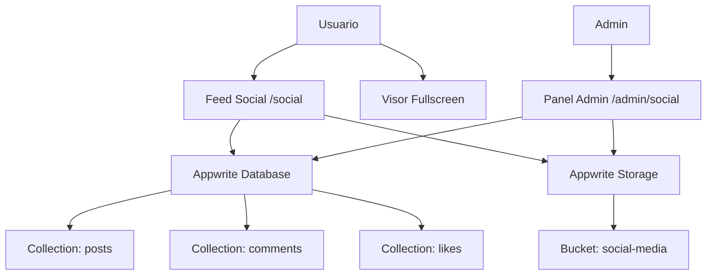

# 🚀 Transformación del Tab Social → Mini Red Social "Muro Radical"

## Contexto

El tab Social actual es una galería estática simple con datos hardcodeados, categorías básicas y un visor fullscreen tipo TikTok. La propuesta es transformarlo en un **feed social completo** tipo Instagram/Twitter con contenido dinámico servido desde Appwrite, interacciones sociales (likes, comentarios), y un panel de administración para gestionar el contenido.

---

## User Review Required

> [!IMPORTANT]
> **Backend Appwrite**: Se utilizará el MCP server de Appwrite para crear la base de datos, colecciones, buckets de storage y configurar permisos. El proyecto ya está conectado a Appwrite (`projectId: 69d8b2ac002de5834ff7`, endpoint: `nyc.cloud.appwrite.io`).

> [!IMPORTANT]
> **Autenticación**: Las interacciones (likes, comentarios) requerirán que el usuario tenga sesión activa (ya existe auth en `/auth`). Los usuarios no autenticados pueden ver el feed pero no interactuar.

> [!WARNING]
> **Admin Panel**: Se creará una ruta `/admin/social` protegida. ¿Quieres definir un listado específico de emails/IDs de admin, o prefieres un label/atributo en la cuenta de Appwrite?

---

## Arquitectura Propuesta

---

## Proposed Changes

### 1. Backend Appwrite (via MCP Server)

Crear las siguientes estructuras en Appwrite:

#### Base de Datos: `radical-social`

**Collection: `posts`**
| Atributo | Tipo | Descripción |
|----------|------|-------------|
| `title` | string(256) | Título del post |
| `description` | string(2000) | Descripción/caption |
| `mediaType` | enum: `image`, `video`, `gallery` | Tipo de contenido |
| `mediaFileIds` | string[] (array) | IDs de archivos en Storage |
| `category` | enum: `promo`, `speaker`, `info`, `archive`, `behind-scenes` | Categoría |
| `featured` | boolean | Si está destacado |
| `pinned` | boolean | Si está fijado arriba |
| `likesCount` | integer | Contador de likes (denormalizado) |
| `commentsCount` | integer | Contador de comentarios |
| `authorName` | string(128) | Nombre del autor/admin |
| `authorAvatar` | string(512) | URL del avatar |
| `status` | enum: `draft`, `published`, `archived` | Estado |
| `publishedAt` | datetime | Fecha de publicación |

**Permisos**: `read("any")`, `create("team:admin")`, `update("team:admin")`, `delete("team:admin")`

**Collection: `likes`**
| Atributo | Tipo | Descripción |
|----------|------|-------------|
| `postId` | string(36) | Referencia al post |
| `userId` | string(36) | ID del usuario |

**Permisos**: `read("any")`, `create("users")`, `delete("users")`
**Índice único**: `postId` + `userId` (evitar doble like)

**Collection: `comments`**
| Atributo | Tipo | Descripción |
|----------|------|-------------|
| `postId` | string(36) | Referencia al post |
| `userId` | string(36) | ID del usuario |
| `userName` | string(128) | Nombre del usuario |
| `content` | string(1000) | Contenido del comentario |
| `createdAt` | datetime | Fecha de creación |

**Permisos**: `read("any")`, `create("users")`, `update("users")`, `delete("users")`

#### Storage Bucket: `social-media`
- Max file size: 100MB (para videos)
- Allowed extensions: `jpg, jpeg, png, webp, gif, mp4, mov, webm`
- Permisos: `read("any")`, `create("team:admin")`

---

### 2. Frontend — Lib/Utils

#### [MODIFY] [appwrite.ts](file:///c:/Users/JhonAQ/anntigravity/radical-camp-2025/lib/appwrite.ts)
- Exportar constantes de IDs de database, collections y bucket
- Agregar export de `Storage` client

#### [NEW] [social.ts](file:///c:/Users/JhonAQ/anntigravity/radical-camp-2025/lib/social.ts)
- Funciones helper: `fetchPosts()`, `toggleLike()`, `addComment()`, `fetchComments()`, `getMediaUrl()`
- Lógica de paginación con cursor-based pagination
- Helper para construir URLs de preview de imágenes/videos desde Storage

#### [NEW] [useAuth.ts](file:///c:/Users/JhonAQ/anntigravity/radical-camp-2025/lib/useAuth.ts)
- Custom hook para obtener el usuario logueado
- Cachea en estado global simple (React context o simple module-level state)

---

### 3. Frontend — Social Feed (`/social`)

#### [MODIFY] [page.tsx](file:///c:/Users/JhonAQ/anntigravity/radical-camp-2025/app/social/page.tsx)
Reescritura completa. Nuevos componentes:

**Feed Layout:**
- **Stories Bar** (horizontal scroll en top): Posts destacados/pinned como stories de Instagram
- **Category Tabs**: Filtro deslizable (`Todos`, `Promos`, `Speakers`, `Info`, `Archivo`, `Behind Scenes`)
- **Post Cards**: Cards con aspect ratio dinámico según tipo de media
- **Infinite Scroll**: Carga progresiva al hacer scroll

**PostCard Component:**
- Avatar + nombre del autor + tiempo relativo ("hace 2h")
- Media (imagen/video/gallery carousel)
- Barra de acciones: ❤️ Like (con animación corazón), 💬 Comentar, ↗️ Compartir, ⬇️ Descargar
- Contador de likes y preview de comentarios
- Caption expandible con "ver más"

**Comments Bottom Sheet:**
- Sheet deslizable desde abajo (como Instagram)
- Input fijo en la parte inferior
- Lista de comentarios con avatar, nombre, tiempo
- Opción de eliminar propio comentario

**Fullscreen Viewer (preservado y mejorado):**
- Mantener el motor de scroll vertical tipo TikTok (que te gusta)
- Agregar overlay de interacciones (like, comment, share) en el lateral derecho
- Counter animado para likes
- Botón de comentarios que abre bottom sheet

---

### 4. Frontend — Componentes Nuevos

#### [NEW] PostCard.tsx — `app/social/components/PostCard.tsx`
Renderiza una publicación individual con media, interacciones, etc.

#### [NEW] CommentsSheet.tsx — `app/social/components/CommentsSheet.tsx`
Bottom sheet de comentarios con input, lista y animaciones.

#### [NEW] StoriesBar.tsx — `app/social/components/StoriesBar.tsx`
Barra horizontal de posts destacados tipo stories.

#### [NEW] FullscreenViewer.tsx — `app/social/components/FullscreenViewer.tsx`
El visor tipo TikTok mejorado con interacciones sociales.

#### [NEW] MediaRenderer.tsx — `app/social/components/MediaRenderer.tsx`
Componente inteligente que renderiza imágenes, videos o carruseles.

---

### 5. Panel de Administración

#### [NEW] [page.tsx](file:///c:/Users/JhonAQ/anntigravity/radical-camp-2025/app/admin/social/page.tsx)
Panel completo para gestionar el contenido social:

- **Lista de posts** con tabla/grid y acciones rápidas (editar, eliminar, cambiar estado)
- **Formulario de creación**:
  - Upload drag & drop de media (múltiples archivos)
  - Selector de categoría y tipo de media
  - Preview en tiempo real
  - Toggle featured/pinned
  - Estado draft/published
- **Gestión de comentarios**: Moderar/eliminar comentarios reportados
- **Estadísticas básicas**: Total posts, likes, comentarios, engagement

#### [NEW] [layout.tsx](file:///c:/Users/JhonAQ/anntigravity/radical-camp-2025/app/admin/layout.tsx)
Layout del admin con verificación de permisos y sidebar.

---

### 6. Configuración

#### [MODIFY] [next.config.ts](file:///c:/Users/JhonAQ/anntigravity/radical-camp-2025/next.config.ts)
- Agregar hostname de Appwrite Storage a `images.remotePatterns`

---

## Diseño Visual

El feed mantendrá la estética existente **dark cyber futurista** del proyecto:
- Fondo `#050505` con cards `#121212`
- Acentos con gradientes `primary (#6200ea)` → `secondary (#00d4ff)`
- Glassmorphism en overlays y sheets
- Animaciones micro con Framer Motion (like bounce, card reveal, shimmer loading)
- Tipografía Montserrat/Poppins consistente

**Inspiración**: Feed de Instagram + visor de TikTok + dark mode de Twitter/X

---

## Open Questions

> [!IMPORTANT]
> 1. **Admins**: ¿Quieres que se use un team de Appwrite llamado "admin" para controlar quién puede subir contenido? ¿O prefieres una lista hardcodeada de emails?

> [!IMPORTANT]
> 2. **Comentarios**: ¿Los usuarios deben poder comentar con su cuenta de Appwrite, o también quieres permitir comentarios anónimos/con nombre?

> [!NOTE]
> 3. **Historias/Stories**: ¿Quieres que las stories expiren después de cierto tiempo (24h como Instagram), o que sean permanentes (posts pinned/featured)?

> [!NOTE]
> 4. **Notificaciones**: El bell icon en el AppTopBar ya existe. ¿Quieres que se vincule a notificaciones de likes/comentarios en un futuro, o lo dejamos solo visual por ahora?

---

## Verification Plan

### Automated Tests
- Build exitoso: `pnpm run build`
- Verificar que las rutas `/social`, `/admin/social` cargan correctamente

### Manual Verification
1. Crear post desde el panel admin con imagen y video
2. Verificar que el post aparece en el feed
3. Dar like desde una cuenta de usuario → verificar counter se actualiza
4. Escribir comentario → verificar aparece en el sheet
5. Abrir visor fullscreen → verificar scrolling vertical y controles de interacción
6. Verificar diseño mobile-first responsive
7. Browser recording del flujo completo
